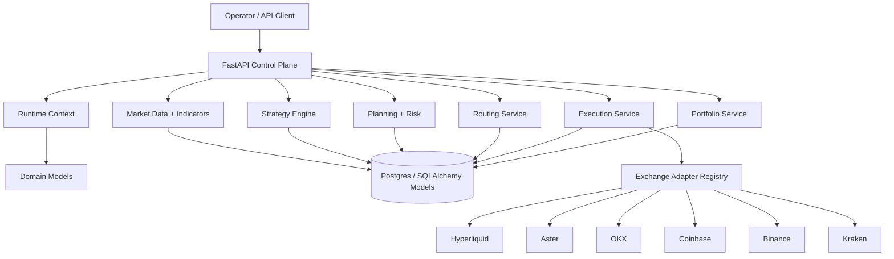

# System Map

Up: [[Money Flow Command Center]]

## Layered View

## Primary Architecture Notes

- [[10 Components/Domain Model]]
- [[10 Components/API Control Plane]]
- [[10 Components/Runtime and Config]]
- [[10 Components/Database and Migrations]]
- [[10 Components/Exchange Adapters]]
- [[90 Reference/File Ownership Quick Reference]]

## Product Shape

Money Flow started as a Money Flow-inspired strategy, but the codebase is now a strategy platform:

- [[30 Strategy/Product North Star]] keeps the long-term business and product frame.
- [[30 Strategy/Money Flow Strategy Lab]] keeps the first strategy family visible.
- [[30 Strategy/Business and Product Track]] captures commercial and operator-tooling direction.

## Operational Shape

- [[40 Operations/Operational Memory]] explains the repo memory discipline.
- [[40 Operations/Known Issues Index]] keeps current risk areas visible.
- [[40 Operations/Future Work Roadmap]] separates implemented behavior from future phases.
- [[40 Operations/Phase 8 Focus]] frames the implemented operator observability/manual-resolution phase and Phase 8.1 handoff.
- [[20 Workflows/Operator Observability and Manual Resolution]] captures the Phase 8.0 workflow target.
