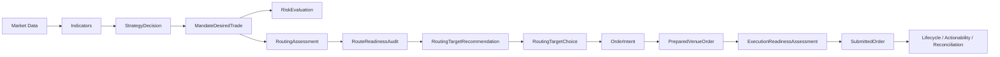
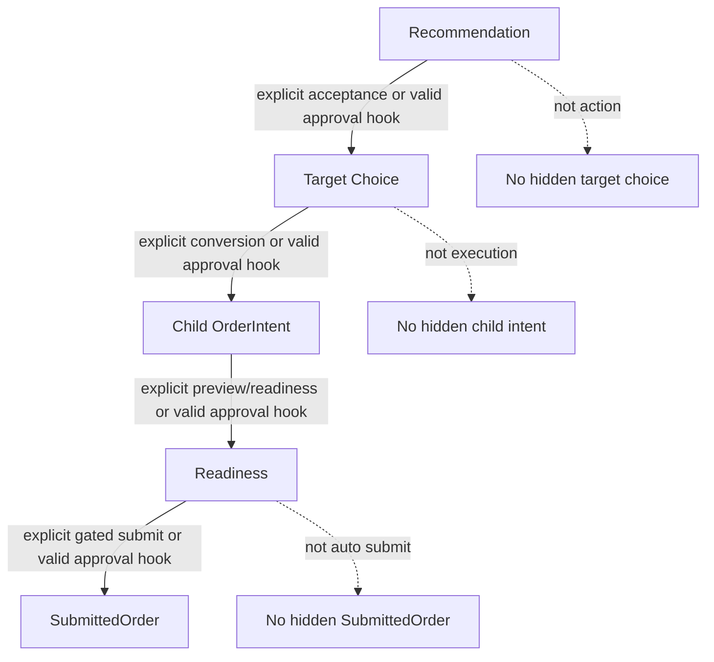

# Workflow Map

Up: [[Money Flow Command Center]]

## Current End-to-End Path

## Workflow Notes

- [[20 Workflows/Current Routed Workflow]]
- [[20 Workflows/Approval Gated Recommendation Acceptance]]
- [[20 Workflows/Execution Lifecycle]]
- [[20 Workflows/Manual Routed Flow Harness]]
- [[20 Workflows/Deferred Smart Routing]]

## Control Boundaries

## Read This First

If you only have five minutes, read:

- [[00 Maps/Current State Dashboard]]
- [[20 Workflows/Current Routed Workflow]]
- [[20 Workflows/Approval Gated Recommendation Acceptance]]
- [[20 Workflows/Operator Observability and Manual Resolution]]
- [[40 Operations/Phase 7 Focus]]
- [[40 Operations/Phase 8 Focus]]
- [[20 Workflows/Deferred Smart Routing]]
