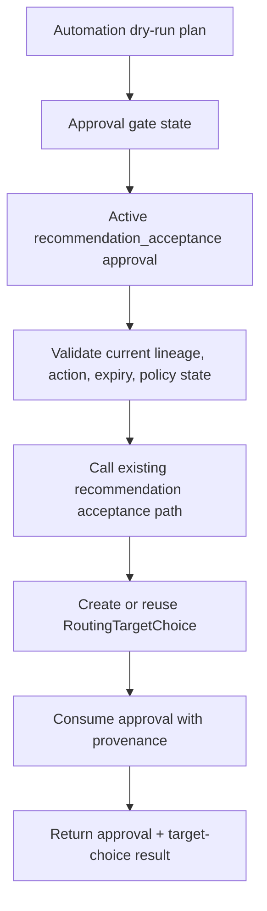

# Approval Gated Recommendation Acceptance

Up: [[00 Maps/Workflow Map]]

## Current Phase 7.2.1 Truth

One active, non-expired, current-lineage `recommendation_acceptance` approval can accept the exact approved `RoutingTargetRecommendation` into a created or reused `RoutingTargetChoice`.

Phase 7.2.1 hardens atomicity: approval validation, target-choice creation/reuse, recommendation/audit marking, approval consumption, and approval provenance update happen in one coherent session/commit.

## Flow

## Blocks Before Target Choice

- Expired approval.
- Revoked approval.
- Stale lineage.
- Wrong action.
- Wrong recommendation.
- Consumed approval for a different recommendation.
- Dry-run-only current policy.
- Manual-only current policy.
- Non-current desired-trade/recommendation/audit/selected-target truth.

## What This Does Not Do

- Does not convert target choice to child intent.
- Does not create readiness.
- Does not submit an order.
- Does not call an exchange.
- Does not create route executor behavior.
- Does not fan out.
- Does not rank, score, or use CBBO.
- Does not reselect target.
- Does not auto-submit.

## Related Notes

- [[40 Operations/Phase 7 Focus]]
- [[10 Components/Routing Service]]
- [[10 Components/API Control Plane]]
- [[20 Workflows/Current Routed Workflow]]
